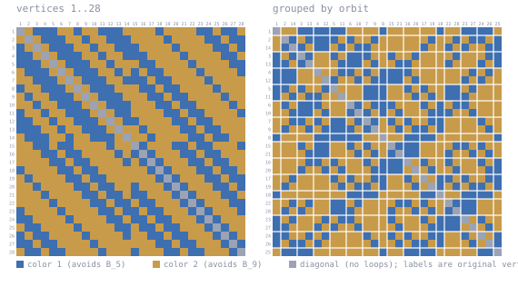

# B(5) / B(9) at n = 28

Forbidden: **B_5 in color 1, B_9 in color 2**, where B_t = K_2 + t*K_1 is a book — t
triangles sharing one edge. So color 1 must have no edge with 5 common color-1 neighbours,
and color 2 no edge with 9 common color-2 neighbours.

A 2-coloring of K_28. DS1 rev #18 Table IXa prints `>= 28` for this cell; 5.3(k) gives
`<= 30`. A coloring of K_28 gives R > 28, i.e. **>= 29**. Unconfirmed, not peer reviewed.

Note this cell is actively worked: Table IXa took three papers in 2026. Treat the deposit as
a coloring, not a priority claim.

## The coloring

<!-- svg:start -->


Left, vertices in their original order 1..28. Right, the same coloring with vertices grouped by the orbits of a recovered automorphism (2+2+2+2+2+2+2+2+2+2+2+2+1+1+1+1); white rules mark the orbit boundaries. Relabeling never changes an edge's color.
<!-- svg:end -->

<details><summary>the same grid as text</summary>

<!-- matrix:start -->
```
     1 2 3 4 5 6 7 8 9 0 1 2 3 4 5 6 7 8 9 0 1 2 3 4 5 6 7 8 
   1 ▒▒░░██████░░░░██░░░░██████░░░░░░░░██░░░░░░░░████░░████░░
   2 ░░▒▒░░██████░░░░██░░░░██████░░░░░░░░██░░░░░░░░████░░████
   3 ██░░▒▒░░██████░░░░██░░░░██████░░░░░░░░██░░░░░░░░████░░██
   4 ████░░▒▒░░██████░░░░██░░░░██████░░░░░░░░██░░░░░░░░████░░
   5 ██████░░▒▒░░██████░░░░██░░░░░░████░░░░░░░░██░░░░░░░░████
   6 ░░██████░░▒▒░░██████░░░░██░░██░░████░░░░░░░░██░░░░░░░░██
   7 ░░░░██████░░▒▒░░██████░░░░██████░░████░░░░░░░░██░░░░░░░░
   8 ██░░░░██████░░▒▒░░██████░░░░░░████░░████░░░░░░░░██░░░░░░
   9 ░░██░░░░██████░░▒▒░░██████░░░░░░████░░████░░░░░░░░██░░░░
  10 ░░░░██░░░░██████░░▒▒░░██████░░░░░░████░░████░░░░░░░░██░░
  11 ██░░░░██░░░░██████░░▒▒░░████░░░░░░░░████░░████░░░░░░░░██
  12 ████░░░░██░░░░██████░░▒▒░░████░░░░░░░░████░░████░░░░░░░░
  13 ██████░░░░██░░░░██████░░▒▒░░░░██░░░░░░░░████░░████░░░░░░
  14 ░░██████░░░░██░░░░██████░░▒▒░░░░██░░░░░░░░████░░████░░░░
  15 ░░░░████░░████░░░░░░░░██░░░░▒▒██░░░░░░████░░████░░░░░░██
  16 ░░░░░░████░░████░░░░░░░░██░░██▒▒██░░░░░░████░░████░░░░░░
  17 ░░░░░░░░████░░████░░░░░░░░██░░██▒▒██░░░░░░████░░████░░░░
  18 ██░░░░░░░░████░░████░░░░░░░░░░░░██▒▒██░░░░░░████░░████░░
  19 ░░██░░░░░░░░████░░████░░░░░░░░░░░░██▒▒██░░░░░░████░░████
  20 ░░░░██░░░░░░░░████░░████░░░░██░░░░░░██▒▒██░░░░░░████░░██
  21 ░░░░░░██░░░░░░░░████░░████░░████░░░░░░██▒▒██░░░░░░████░░
  22 ░░░░░░░░██░░░░░░░░████░░████░░████░░░░░░██▒▒██░░░░░░████
  23 ██░░░░░░░░██░░░░░░░░████░░████░░████░░░░░░██▒▒██░░░░░░██
  24 ████░░░░░░░░██░░░░░░░░████░░████░░████░░░░░░██▒▒██░░░░░░
  25 ░░████░░░░░░░░██░░░░░░░░████░░████░░████░░░░░░██▒▒██░░░░
  26 ██░░████░░░░░░░░██░░░░░░░░██░░░░████░░████░░░░░░██▒▒██░░
  27 ████░░████░░░░░░░░██░░░░░░░░░░░░░░████░░████░░░░░░██▒▒██
  28 ░░████░░████░░░░░░░░██░░░░░░██░░░░░░████░░████░░░░░░██▒▒
```
<!-- matrix:end -->

</details>

## Check

```
python3 ../tools/check_book.py witness/witness_b5b9_n28.txt B5,B9
```
