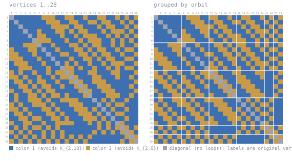

# K(2,10)/K(2,6) at n = 28

Forbidden here: **K_{2,10} in color 1, K_{2,6} in color 2**.

A 2-coloring of K_28. Work in progress, unconfirmed, not peer reviewed.

DS1 rev #18 prints `27-29` for this cell. A coloring of K_28 gives R > 28, i.e. **>= 29**.
Table IVc already prints the upper bound 29, so this lower bound would meet it and settle
the cell at 29. The equality is the two bounds together; the coloring alone gives only the
lower one.

## The coloring

<!-- svg:start -->


Left, vertices in their original order 1..28. Right, the same coloring with vertices grouped by the orbits of a recovered automorphism (6+6+6+6+2+2); white rules mark the orbit boundaries. Relabeling never changes an edge's color.
<!-- svg:end -->

<details><summary>the same grid as text</summary>

<!-- matrix:start -->
```
     1 2 3 4 5 6 7 8 9 0 1 2 3 4 5 6 7 8 9 0 1 2 3 4 5 6 7 8 
   1 ▒▒████████████░░░░░░████░░░░████░░████░░░░████░░██░░██░░
   2 ██▒▒████████████░░░░░░████░░░░████░░░░██░░░░████░░██░░██
   3 ████▒▒████████████░░░░░░░░██░░░░██████░░██░░░░████░░██░░
   4 ██████▒▒████░░██████░░░░██░░██░░░░██████░░██░░░░░░██░░██
   5 ████████▒▒██░░░░██████░░████░░██░░░░░░████░░██░░██░░██░░
   6 ██████████▒▒░░░░░░██████░░████░░██░░░░░░████░░██░░██░░██
   7 ██████░░░░░░▒▒████░░██████░░░░██░░██░░░░████░░██░░████░░
   8 ░░██████░░░░██▒▒████░░██████░░░░██░░██░░░░████░░██░░░░██
   9 ░░░░██████░░████▒▒████░░░░████░░░░██░░██░░░░████░░████░░
  10 ░░░░░░██████░░████▒▒██████░░████░░░░██░░██░░░░████░░░░██
  11 ██░░░░░░██████░░████▒▒██░░██░░████░░████░░██░░░░░░████░░
  12 ████░░░░░░██████░░████▒▒░░░░██░░████░░████░░██░░██░░░░██
  13 ░░██░░████░░████░░██░░░░▒▒░░██████░░░░██████░░░░██████░░
  14 ░░░░██░░████░░████░░██░░░░▒▒░░██████░░░░██████░░████░░██
  15 ██░░░░██░░██░░░░████░░████░░▒▒░░████░░░░░░████████████░░
  16 ████░░░░██░░██░░░░████░░████░░▒▒░░████░░░░░░████████░░██
  17 ░░████░░░░██░░██░░░░██████████░░▒▒░░████░░░░░░████████░░
  18 ██░░████░░░░██░░██░░░░██░░██████░░▒▒██████░░░░░░████░░██
  19 ██░░████░░░░░░██░░████░░░░░░░░██████▒▒██░░██░░████░░████
  20 ░░██░░████░░░░░░██░░██████░░░░░░██████▒▒██░░██░░░░██████
  21 ░░░░██░░██████░░░░██░░██████░░░░░░██░░██▒▒██░░████░░████
  22 ██░░░░██░░██████░░░░██░░██████░░░░░░██░░██▒▒██░░░░██████
  23 ████░░░░██░░░░████░░░░██░░██████░░░░░░██░░██▒▒████░░████
  24 ░░████░░░░████░░████░░░░░░░░██████░░██░░██░░██▒▒░░██████
  25 ██░░██░░██░░░░██░░██░░████████████████░░██░░██░░▒▒░░██░░
  26 ░░██░░██░░████░░██░░██░░████████████░░██░░██░░██░░▒▒░░██
  27 ██░░██░░██░░██░░██░░██░░██░░██░░██░░██████████████░░▒▒░░
  28 ░░██░░██░░██░░██░░██░░██░░██░░██░░██████████████░░██░░▒▒
```
<!-- matrix:end -->

</details>

## Check it

```
python3 ../tools/check_ramsey.py witness/witness_k2x10k2x6_n28.txt K2x10,K2x6
```
