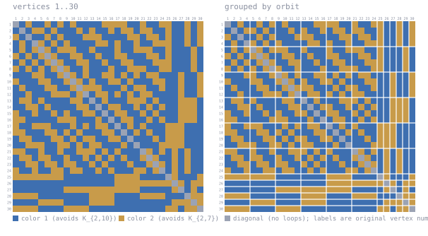

# K(2,10)/K(2,7) at n = 30

Forbidden here: **K_{2,10} in color 1, K_{2,7} in color 2**.

A 2-coloring of K_30. Work in progress, unconfirmed, not peer reviewed.

DS1 rev #18 prints `29-31` for this cell. A coloring of K_30 gives R > 30, i.e. **>= 31**.
Table IVc already prints the upper bound 31, so this lower bound would meet it and settle
the cell at 31. The equality is the two bounds together; the coloring alone gives only the
lower one.

## The coloring

<!-- svg:start -->


Left, vertices in their original order 1..30. Right, the same coloring with vertices grouped by the orbits of a recovered automorphism (4+4+4+4+4+4+1+1+1+1+1+1); white rules mark the orbit boundaries. Relabeling never changes an edge's color.
<!-- svg:end -->

<details><summary>the same grid as text</summary>

<!-- matrix:start -->
```
     1 2 3 4 5 6 7 8 9 0 1 2 3 4 5 6 7 8 9 0 1 2 3 4 5 6 7 8 9 0 
   1 ▒▒██░░████░░██░░██░░████████░░░░░░░░████░░████░░░░████░░██░░
   2 ██▒▒██░░░░██░░██████░░██░░████░░██░░░░██░░░░████░░████░░██░░
   3 ░░██▒▒████░░██░░██████░░░░░░████████░░░░██░░░░██░░████░░██░░
   4 ██░░██▒▒░░██░░██░░████████░░░░██░░████░░████░░░░░░████░░██░░
   5 ██░░██░░▒▒░░██░░░░░░████░░██████░░████░░░░░░████░░██████░░██
   6 ░░██░░██░░▒▒░░████░░░░████░░████░░░░██████░░░░██░░██████░░██
   7 ██░░██░░██░░▒▒░░████░░░░████░░████░░░░██████░░░░░░██████░░██
   8 ░░██░░██░░██░░▒▒░░████░░██████░░████░░░░░░████░░░░██████░░██
   9 ██████░░░░████░░▒▒░░██░░████░░░░██░░██░░██░░░░██████░░████░░
  10 ░░██████░░░░████░░▒▒░░██░░████░░░░██░░██████░░░░████░░████░░
  11 ██░░██████░░░░████░░▒▒░░░░░░██████░░██░░░░████░░████░░████░░
  12 ████░░██████░░░░░░██░░▒▒██░░░░██░░██░░██░░░░████████░░████░░
  13 ██░░░░██░░████████░░░░██▒▒██░░██████░░░░░░██░░██████░░░░░░██
  14 ████░░░░██░░████████░░░░██▒▒██░░░░████░░██░░██░░████░░░░░░██
  15 ░░████░░████░░██░░████░░░░██▒▒██░░░░████░░██░░██████░░░░░░██
  16 ░░░░██████████░░░░░░██████░░██▒▒██░░░░████░░██░░████░░░░░░██
  17 ░░████░░░░░░██████░░██░░██░░░░██▒▒██░░██░░██████░░░░░░██████
  18 ░░░░██████░░░░██░░██░░██████░░░░██▒▒██░░██░░████░░░░░░██████
  19 ██░░░░██████░░░░██░░██░░░░████░░░░██▒▒██████░░██░░░░░░██████
  20 ████░░░░░░████░░░░██░░██░░░░██████░░██▒▒██████░░░░░░░░██████
  21 ░░░░████░░████░░████░░░░░░██░░██░░██████▒▒░░██░░██░░██░░████
  22 ██░░░░██░░░░████░░████░░██░░██░░██░░████░░▒▒░░████░░██░░████
  23 ████░░░░██░░░░██░░░░████░░██░░██████░░████░░▒▒░░██░░██░░████
  24 ░░████░░████░░░░██░░░░████░░██░░██████░░░░██░░▒▒██░░██░░████
  25 ░░░░░░░░░░░░░░░░████████████████░░░░░░░░████████▒▒░░██████░░
  26 ████████████████████████████████░░░░░░░░░░░░░░░░░░▒▒░░██░░░░
  27 ████████████████░░░░░░░░░░░░░░░░░░░░░░░░██████████░░▒▒██░░██
  28 ░░░░░░░░████████████████░░░░░░░░████████░░░░░░░░██████▒▒░░░░
  29 ████████░░░░░░░░████████░░░░░░░░██████████████████░░░░░░▒▒░░
  30 ░░░░░░░░████████░░░░░░░░████████████████████████░░░░██░░░░▒▒
```
<!-- matrix:end -->

</details>

## Check it

```
python3 ../tools/check_ramsey.py witness/witness_k2x10k2x7_n30.txt K2x10,K2x7
```
