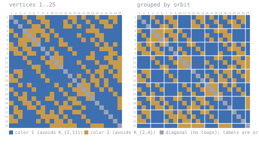

# K(2,11)/K(2,4) at n = 25

Forbidden here: **K_{2,11} in color 1, K_{2,4} in color 2**.

A 2-coloring of K_25. Work in progress, unconfirmed, not peer reviewed.

DS1 rev #18 prints `>= 25` for this cell. A coloring of K_25 gives R > 25, i.e. **>= 26**.
Table IVc row 11 prints a bare lower bound for this cell; 3.3.2(j) gives 27 above.

## The coloring

<!-- svg:start -->


Left, vertices in their original order 1..25. Right, the same coloring with vertices grouped by the orbits of a recovered automorphism (3+3+3+3+3+3+3+3+1); white rules mark the orbit boundaries. Relabeling never changes an edge's color.
<!-- svg:end -->

<details><summary>the same grid as text</summary>

<!-- matrix:start -->
```
     1 2 3 4 5 6 7 8 9 0 1 2 3 4 5 6 7 8 9 0 1 2 3 4 5 
   1 ▒▒████░░████░░░░██████████░░░░██░░████░░████░░░░██
   2 ██▒▒████░░████░░░░██████░░██░░████░░████░░░░██░░██
   3 ████▒▒████░░░░██░░██████░░░░██░░████░░████░░░░████
   4 ░░████▒▒░░░░░░░░██░░██████████████░░░░░░██████████
   5 ██░░██░░▒▒░░██░░░░██░░████████░░██████░░░░████████
   6 ████░░░░░░▒▒░░██░░████░░████████░░██░░██░░████████
   7 ░░██░░░░██░░▒▒████████░░░░████████████░░██░░██░░██
   8 ░░░░██░░░░████▒▒██░░██████░░████████████░░░░░░████
   9 ██░░░░██░░░░████▒▒██░░██████░░██████░░██████░░░░██
  10 ██████░░██████░░██▒▒░░░░██████████░░░░████░░░░██░░
  11 ████████░░██████░░░░▒▒░░██████░░██████░░████░░░░░░
  12 ██████████░░░░████░░░░▒▒████████░░██████░░░░██░░░░
  13 ██░░░░██████░░██████████▒▒████████░░██░░░░██░░██░░
  14 ░░██░░████████░░██████████▒▒██░░████░░██░░████░░░░
  15 ░░░░████████████░░██████████▒▒██░░██░░░░██░░████░░
  16 ████░░██░░██████████░░████░░██▒▒░░░░██░░██░░██████
  17 ░░████████░░██████████░░████░░░░▒▒░░████░░██░░████
  18 ██░░██░░██████████░░████░░████░░░░▒▒░░████████░░██
  19 ████░░░░██░░████░░░░██████░░░░████░░▒▒██████████░░
  20 ░░████░░░░██░░██████░░██░░██░░░░██████▒▒████████░░
  21 ██░░████░░░░██░░██████░░░░░░████░░██████▒▒██████░░
  22 ██░░░░██████░░░░██░░██░░████░░░░██████████▒▒██████
  23 ░░██░░████████░░░░░░░░██░░██████░░██████████▒▒████
  24 ░░░░████████░░██░░██░░░░██░░██████░░██████████▒▒██
  25 ██████████████████░░░░░░░░░░░░██████░░░░░░██████▒▒
```
<!-- matrix:end -->

</details>

## Check it

```
python3 ../tools/check_ramsey.py witness/witness_k2x11k2x4_n25.txt K2x11,K2x4
```
