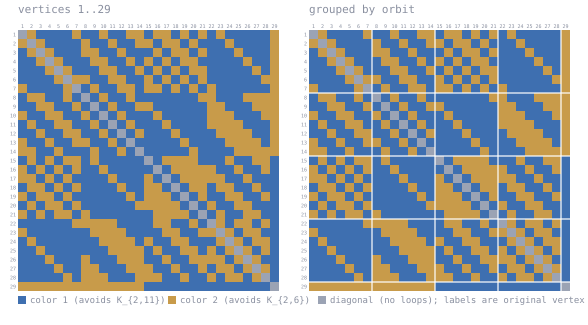

# K(2,11)/K(2,6) at n = 29

Forbidden here: **K_{2,11} in color 1, K_{2,6} in color 2**.

A 2-coloring of K_29. Work in progress, unconfirmed, not peer reviewed.

DS1 rev #18 prints `>= 29` for this cell. A coloring of K_29 gives R > 29, i.e. **>= 30**.
Table IVc row 11 prints a bare lower bound for this cell; 3.3.2(j) gives 31 above.

## The coloring

<!-- svg:start -->


Left, vertices in their original order 1..29. Right, the same coloring with vertices grouped by the orbits of a recovered automorphism (7+7+7+7+1); white rules mark the orbit boundaries. Relabeling never changes an edge's color.
<!-- svg:end -->

<details><summary>the same grid as text</summary>

<!-- matrix:start -->
```
     1 2 3 4 5 6 7 8 9 0 1 2 3 4 5 6 7 8 9 0 1 2 3 4 5 6 7 8 9 
   1 ▒▒░░████████░░████░░████░░░░██░░░░██░░██░░██░░██████████░░
   2 ░░▒▒░░████████░░████░░████░░░░██░░░░██░░██████░░████████░░
   3 ██░░▒▒░░██████░░░░████░░██████░░██░░░░██░░██████░░██████░░
   4 ████░░▒▒░░██████░░░░████░░██░░██░░██░░░░██████████░░████░░
   5 ██████░░▒▒░░██████░░░░████░░██░░██░░██░░░░██████████░░██░░
   6 ████████░░▒▒░░░░████░░░░████░░██░░██░░██░░████████████░░░░
   7 ░░████████░░▒▒██░░████░░░░██░░░░██░░██░░██░░████████████░░
   8 ██░░░░████░░██▒▒██░░████░░██████████████░░░░██████░░░░░░░░
   9 ████░░░░████░░██▒▒██░░████░░░░████████████░░░░██████░░░░░░
  10 ░░████░░░░████░░██▒▒██░░██████░░██████████░░░░░░██████░░░░
  11 ██░░████░░░░████░░██▒▒██░░██████░░████████░░░░░░░░██████░░
  12 ████░░████░░░░████░░██▒▒██░░██████░░████████░░░░░░░░████░░
  13 ░░████░░████░░░░████░░██▒▒██████████░░████████░░░░░░░░██░░
  14 ░░░░████░░██████░░████░░██▒▒██████████░░████████░░░░░░░░░░
  15 ██░░██░░██░░░░██░░██████████▒▒██░░░░░░░░██████░░████░░░░██
  16 ░░██░░██░░██░░████░░██████████▒▒██░░░░░░░░░░████░░████░░██
  17 ░░░░██░░██░░████████░░██████░░██▒▒██░░░░░░░░░░████░░██████
  18 ██░░░░██░░██░░████████░░████░░░░██▒▒██░░░░██░░░░████░░████
  19 ░░██░░░░██░░████████████░░██░░░░░░██▒▒██░░████░░░░████░░██
  20 ██░░██░░░░██░░████████████░░░░░░░░░░██▒▒██░░████░░░░██████
  21 ░░██░░██░░░░██░░██████████████░░░░░░░░██▒▒██░░████░░░░████
  22 ████████████░░░░░░░░░░████████░░░░████░░██▒▒░░██░░░░██░░██
  23 ░░██████████████░░░░░░░░████████░░░░████░░░░▒▒░░██░░░░████
  24 ██░░██████████████░░░░░░░░██░░████░░░░██████░░▒▒░░██░░░░██
  25 ████░░██████████████░░░░░░░░██░░████░░░░██░░██░░▒▒░░██░░██
  26 ██████░░██████░░██████░░░░░░████░░████░░░░░░░░██░░▒▒░░████
  27 ████████░░████░░░░██████░░░░░░████░░████░░██░░░░██░░▒▒░░██
  28 ██████████░░██░░░░░░██████░░░░░░████░░████░░██░░░░██░░▒▒██
  29 ░░░░░░░░░░░░░░░░░░░░░░░░░░░░████████████████████████████▒▒
```
<!-- matrix:end -->

</details>

## Check it

```
python3 ../tools/check_ramsey.py witness/witness_k2x11k2x6_n29.txt K2x11,K2x6
```
