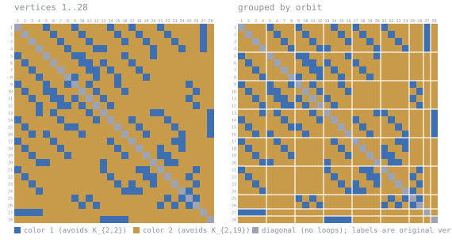

# K(2,2)/K(2,19) at n = 28

Forbidden here: **K_{2,2} in color 1, K_{2,19} in color 2**.

A 2-coloring of K_28. Work in progress, unconfirmed, not peer reviewed.

DS1 rev #18 section 3.3.1(f) prints the sequence `20, 22, 22, 24, 25, 26, 27, 28/29, 30, 32`
for R(K_{2,2}, K_{2,n}) over `12 <= n <= 21`. The eighth entry is n = 19, so this cell stands
at **28/29** -- known to be one of the two, not resolved between them. A coloring of K_28
gives R > 28, i.e. **>= 29**, which rules out 28 and would settle the cell at **29**.

This cell is outside Table IVc, which stops at n = 11; the bound lives in the running text
of 3.3.1(f) instead. An earlier version of this file claimed no baseline could be found,
having searched only the table.

## The coloring

<!-- svg:start -->


Left, vertices in their original order 1..28. Right, the same coloring with vertices grouped by the orbits of a recovered automorphism (4+4+4+4+4+4+2+1+1); white rules mark the orbit boundaries. Relabeling never changes an edge's color.
<!-- svg:end -->

<details><summary>the same grid as text</summary>

<!-- matrix:start -->
```
     1 2 3 4 5 6 7 8 9 0 1 2 3 4 5 6 7 8 9 0 1 2 3 4 5 6 7 8 
   1 ▒▒░░░░░░██░░░░░░██░░░░░░░░██░░░░██░░░░░░██░░░░░░░░░░██░░
   2 ░░▒▒░░░░░░██░░░░░░██░░░░░░░░██░░░░██░░░░░░██░░░░░░░░██░░
   3 ░░░░▒▒░░░░░░██░░░░░░██░░░░░░░░██░░░░██░░░░░░██░░░░░░██░░
   4 ░░░░░░▒▒░░░░░░██░░░░░░████░░░░░░░░░░░░██░░░░░░██░░░░██░░
   5 ██░░░░░░▒▒░░░░░░████░░░░░░░░░░██░░░░░░██░░░░░░░░░░░░░░░░
   6 ░░██░░░░░░▒▒░░░░░░████░░██░░░░░░██░░░░░░░░░░░░░░░░░░░░░░
   7 ░░░░██░░░░░░▒▒░░░░░░████░░██░░░░░░██░░░░░░░░░░░░░░░░░░░░
   8 ░░░░░░██░░░░░░▒▒██░░░░██░░░░██░░░░░░██░░░░░░░░░░░░░░░░░░
   9 ██░░░░░░██░░░░██▒▒░░██░░░░░░██░░░░░░░░░░░░░░░░░░██░░░░░░
  10 ░░██░░░░████░░░░░░▒▒░░██░░░░░░██░░░░░░░░░░░░░░░░░░██░░░░
  11 ░░░░██░░░░████░░██░░▒▒░░██░░░░░░░░░░░░░░░░░░░░░░██░░░░░░
  12 ░░░░░░██░░░░████░░██░░▒▒░░██░░░░░░░░░░░░░░░░░░░░░░██░░░░
  13 ░░░░░░██░░██░░░░░░░░██░░▒▒░░░░░░░░░░░░████░░░░░░░░░░░░██
  14 ██░░░░░░░░░░██░░░░░░░░██░░▒▒░░░░██░░░░░░░░██░░░░░░░░░░██
  15 ░░██░░░░░░░░░░████░░░░░░░░░░▒▒░░░░██░░░░░░░░██░░░░░░░░██
  16 ░░░░██░░██░░░░░░░░██░░░░░░░░░░▒▒░░░░██░░░░░░░░██░░░░░░██
  17 ██░░░░░░░░██░░░░░░░░░░░░░░██░░░░▒▒░░░░░░░░░░████░░░░░░░░
  18 ░░██░░░░░░░░██░░░░░░░░░░░░░░██░░░░▒▒░░░░██░░░░██░░░░░░░░
  19 ░░░░██░░░░░░░░██░░░░░░░░░░░░░░██░░░░▒▒░░████░░░░░░░░░░░░
  20 ░░░░░░████░░░░░░░░░░░░░░██░░░░░░░░░░░░▒▒░░████░░░░░░░░░░
  21 ██░░░░░░░░░░░░░░░░░░░░░░██░░░░░░░░████░░▒▒░░░░░░░░██░░░░
  22 ░░██░░░░░░░░░░░░░░░░░░░░░░██░░░░░░░░████░░▒▒░░░░██░░░░░░
  23 ░░░░██░░░░░░░░░░░░░░░░░░░░░░██░░██░░░░██░░░░▒▒░░░░██░░░░
  24 ░░░░░░██░░░░░░░░░░░░░░░░░░░░░░██████░░░░░░░░░░▒▒██░░░░░░
  25 ░░░░░░░░░░░░░░░░██░░██░░░░░░░░░░░░░░░░░░░░██░░██▒▒██░░░░
  26 ░░░░░░░░░░░░░░░░░░██░░██░░░░░░░░░░░░░░░░██░░██░░██▒▒░░░░
  27 ████████░░░░░░░░░░░░░░░░░░░░░░░░░░░░░░░░░░░░░░░░░░░░▒▒░░
  28 ░░░░░░░░░░░░░░░░░░░░░░░░████████░░░░░░░░░░░░░░░░░░░░░░▒▒
```
<!-- matrix:end -->

</details>

## Check it

```
python3 ../tools/check_ramsey.py witness/witness_k2x2k2x19_n28.txt K2x2,K2x19
```
