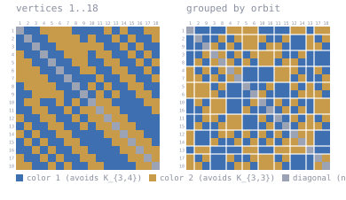

# K(3,4) / K(3,3) at n = 19

Forbidden here: **K_{3,4} in color 1, K_{3,3} in color 2**.

Inputs and outputs of a computation, deposited so it can be repeated. Not a claim,
unconfirmed, not peer reviewed.

DS1 rev #18, Table IVb, row 3,4 column 3,3: `19-20`. A K_{3,4}/K_{3,3}-free coloring of
K_18 gives R > 18; unsatisfiability at n = 19 gives R <= 19. Together, 19.

`lean/Encoder.lean` writes the encoding of `tools/gen_ramsey.py` in Lean and
`lean/EncoderBridge.lean` checks it against `instance/k34k33_n19.cnf` by evaluation.
Soundness lemmas for the encoding are in <https://github.com/alejandrozarco/sbsound>.

## The K_18 coloring is not ours

`witness/witness_k34k33_n18.txt` is Steven Van Overberghe's published construction,
byte-equivalent to `K(3,4)K(3,3)n18.g6` in
<https://github.com/Steven-VO/circulant-Ramsey> (that repository is GPL-3.0), cited in
DS1 as [VO]. It is
here so the lower bound can be checked beside the upper-bound computation, which is the
part done here.

<!-- svg:start -->


Left, vertices in their original order 1..18. Right, the same coloring with vertices grouped by the orbits of a recovered automorphism (2+2+2+2+2+2+2+2+1+1); white rules mark the orbit boundaries. Relabeling never changes an edge's color.
<!-- svg:end -->

<details><summary>the same grid as text</summary>

<!-- matrix:start -->
```
     1 2 3 4 5 6 7 8 9 0 1 2 3 4 5 6 7 8 
   1 ▒▒████░░░░░░░░████████░░██░░████░░░░
   2 ██▒▒████░░░░░░░░██░░████░░██░░████░░
   3 ████▒▒████░░░░░░░░░░░░████░░██░░████
   4 ░░████▒▒████░░░░░░██░░░░████░░██░░██
   5 ░░░░████▒▒████░░░░████░░░░████░░██░░
   6 ░░░░░░████▒▒████░░░░████░░░░████░░██
   7 ░░░░░░░░████▒▒██████░░████░░░░████░░
   8 ██░░░░░░░░████▒▒██░░██░░████░░░░████
   9 ████░░░░░░░░████▒▒██░░██░░████░░░░██
  10 ██░░░░████░░██░░██▒▒░░░░████████░░░░
  11 ████░░░░████░░██░░░░▒▒░░░░████████░░
  12 ░░████░░░░████░░██░░░░▒▒░░░░████████
  13 ██░░████░░░░████░░██░░░░▒▒░░░░██████
  14 ░░██░░████░░░░████████░░░░▒▒░░░░████
  15 ██░░██░░████░░░░████████░░░░▒▒░░░░██
  16 ████░░██░░████░░░░████████░░░░▒▒░░░░
  17 ░░████░░██░░████░░░░████████░░░░▒▒░░
  18 ░░░░████░░██░░████░░░░████████░░░░▒▒
```
<!-- matrix:end -->

</details>

## The upper bound

`instance/k34k33_n19.cnf`, from `tools/gen_ramsey.py`, is intended to be satisfiable
exactly when a K_{3,4}/K_{3,3}-free coloring of K_19 exists, and carries static vertex-lex
symmetry-breaking clauses. It was split into the 571 cubes of
`instance/k34k33_n19_d10.icnf`; CaDiCaL reported every one unsatisfiable and `lrat-check`
accepted every certificate. `instance/cover.lrat` refutes the conjunction of the negated
cubes, so the cubes leave no assignment uncovered. The refutations compose into a Lean 4
theorem `base_unsat : base.Unsat`, where `base` is the DIMACS text of the shipped CNF
embedded in the statement:

```
sha256(instance/k34k33_n19.cnf) = 6a889aa40e0144c8d88b630dd4bc087430e4e719f845566142c53a4440fb8b66
```

The string embedded in the Lean statement hashes to the same value.

The proof itself cannot be shipped: the 571 certificates are about 12 GB and the Lean chunk
modules about 16 GB. Here instead are the statement (`lean/Base.lean`), the composition
(`lean/Main.lean`), the exhaustiveness theorem (`lean/Cover.lean`), one leaf module, one
subcube certificate (`sample/`), the per-cube verdicts (`ledger/`), `reconstruct.sh`,
which regenerates and re-checks every certificate in roughly 2.4 CPU-hours, and
`lean/rebuild.sh`, which goes further and rebuilds the Lean theorem itself.

## Scope

Machine-checked: each of the 571 cubes is unsatisfiable; the decomposition is exhaustive;
`base_unsat` holds in Lean.

Not machine-checked, and argued informally: that the formula is satisfiable exactly when a
K_{3,4}/K_{3,3}-free coloring of K_19 exists — the codegree encoding puts 105,213 variables
in play of which only 342 are edge variables, so faithfulness is a statement about the Sinz
counter layer; and that the symmetry-breaking clauses empty no orbit. The lower bound is
checked by a Python script rather than in Lean.

`native_decide` puts the Lean compiler in the trusted base alongside the kernel. One
implementation, one run, not independently re-derived.

## Files

| path | what |
|---|---|
| `witness/` | the K_18 coloring (Van Overberghe's) and its matrix |
| `instance/` | the formula, its 571-cube decomposition, the cover certificate |
| `lean/` | statement, cover theorem, composing module, one leaf module |
| `sample/leaf1.lrat` | one subcube's certificate, checkable alone |
| `ledger/` | per-cube result, certificate size, `verified` |
| `AXIOMS.txt`, `LEAN.md` | axiom output; how to rebuild the theorem |
| `lean/rebuild.sh` | rebuilds the theorem from this repository, end to end |
| `tools/` | encoder, and a checker sharing no code with it |
| `reconstruct.sh`, `SHA256SUMS` | redo the computation; checksums |
