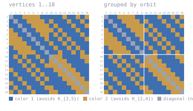

# K(3,5) / K(2,4) at n = 19

Forbidden: **K_{3,5} in color 1, K_{2,4} in color 2**. DS1 rev #18 Table IVb prints `19-20`.

`witness/` holds a coloring of K_18, so R > 18. `ledger/` holds the refutation at n=19:
389 + 1602 subcubes, every one UNSAT, so no coloring of K_19 exists and R <= 19.
Together **R = 19**.

The coloring is checkable in seconds. The refutation is not: it additionally needs the
encoding to be faithful, the symmetry breaking to be sound, and the cube cover to be
exhaustive. Those are not machine-checked here.

## The coloring

<!-- svg:start -->


Left, vertices in their original order 1..18. Right, the same coloring with vertices grouped by the orbits of a recovered automorphism (9+9); white rules mark the orbit boundaries. Relabeling never changes an edge's color.
<!-- svg:end -->

<details><summary>the same grid as text</summary>

<!-- matrix:start -->
```
     1 2 3 4 5 6 7 8 9 0 1 2 3 4 5 6 7 8 
   1 ▒▒████░░░░░░░░██████████░░████░░██░░
   2 ██▒▒████░░░░░░░░██░░██████░░████░░██
   3 ████▒▒████░░░░░░░░██░░██████░░████░░
   4 ░░████▒▒████░░░░░░░░██░░██████░░████
   5 ░░░░████▒▒████░░░░██░░██░░██████░░██
   6 ░░░░░░████▒▒████░░████░░██░░██████░░
   7 ░░░░░░░░████▒▒████░░████░░██░░██████
   8 ██░░░░░░░░████▒▒████░░████░░██░░████
   9 ████░░░░░░░░████▒▒████░░████░░██░░██
  10 ██░░██░░████░░████▒▒░░░░████████░░░░
  11 ████░░██░░████░░██░░▒▒░░░░████████░░
  12 ██████░░██░░████░░░░░░▒▒░░░░████████
  13 ░░██████░░██░░██████░░░░▒▒░░░░██████
  14 ██░░██████░░██░░██████░░░░▒▒░░░░████
  15 ████░░██████░░██░░██████░░░░▒▒░░░░██
  16 ░░████░░██████░░██████████░░░░▒▒░░░░
  17 ██░░████░░██████░░░░████████░░░░▒▒░░
  18 ░░██░░████░░██████░░░░████████░░░░▒▒
```
<!-- matrix:end -->

</details>

## Check

```
python3 ../tools/check_ramsey.py witness/witness_k35k24_n18.txt K3x5,K2x4
```
