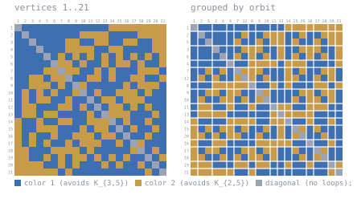

# K(3,5) / K(2,5) at n = 21

Forbidden here: **K_{3,5} in color 1, K_{2,5} in color 2**.

A 2-coloring of K_21 and the inputs that produced it. Not a claim, unconfirmed, not peer
reviewed.

DS1 rev #18, Table IVb, row 3,5 column 2,5: `21-23`, ref `VO-LidP`. The caption adds
"the bound R (K 3, 5, K 2, 5 ) >= 21 is also in [ShaoWX]".

## The coloring

<!-- svg:start -->


Left, vertices in their original order 1..21. Right, the same coloring with vertices grouped by the orbits of a recovered automorphism (2+2+2+2+2+2+1+1+1+1+1+1+1+1+1); white rules mark the orbit boundaries. Relabeling never changes an edge's color.
<!-- svg:end -->

<details><summary>the same grid as text</summary>

<!-- matrix:start -->
```
     1 2 3 4 5 6 7 8 9 0 1 2 3 4 5 6 7 8 9 0 1 
   1 ▒▒████████████████████████░░░░░░░░░░░░░░░░
   2 ██▒▒██████████████░░░░░░░░████████░░░░░░░░
   3 ████▒▒████████░░░░████░░░░████░░░░████░░░░
   4 ██████▒▒██████░░░░░░░░████░░░░████████░░░░
   5 ████████▒▒██░░██░░██░░██░░██░░██░░██░░██░░
   6 ██████████▒▒░░░░██░░████░░██░░░░██░░████░░
   7 ████████░░░░▒▒░░░░████░░██░░██████░░░░░░██
   8 ████░░░░██░░░░▒▒████░░░░██░░████░░░░████░░
   9 ████░░░░░░██░░██▒▒░░██████████░░██░░░░░░██
  10 ██░░██░░██░░████░░▒▒██░░████░░░░░░██░░████
  11 ██░░██░░░░████░░████▒▒██░░░░██░░░░░░██████
  12 ██░░░░██████░░░░██░░██▒▒██░░░░██░░██░░████
  13 ██░░░░██░░░░████████░░██▒▒░░░░░░██████░░██
  14 ░░████░░████░░░░████░░░░░░▒▒██░░████░░████
  15 ░░████░░░░░░██████░░██░░░░██▒▒██░░████░░██
  16 ░░██░░████░░████░░░░░░██░░░░██▒▒████░░████
  17 ░░██░░██░░████░░██░░░░░░████░░██▒▒░░██████
  18 ░░░░██████░░░░░░░░██░░██████████░░▒▒██░░██
  19 ░░░░████░░██░░██░░░░██░░██░░██░░████▒▒██░░
  20 ░░░░░░░░████░░██░░██████░░██░░████░░██▒▒██
  21 ░░░░░░░░░░░░██░░████████████████████░░██▒▒
```
<!-- matrix:end -->

</details>

`witness/witness_k35k25_n21.txt` has the same thing as 210 lines of `i j c`.

```sh
python3 tools/check_ramsey.py witness/witness_k35k25_n21.txt K3x5,K2x5
bash verify.sh          # re-decode the raw model, re-check two ways, re-encode the CNF
```

If the check is right it gives R(K_{3,5}, K_{2,5}) > 21, one above the listed lower bound.

## Provenance

CaDiCaL 3.0.1 found it on subcube 246 of `instance/k35k25_n21_d10.icnf` applied to
`instance/k35k25_n21.cnf`, generated by `tools/gen_ramsey.py 21 K3x5,K2x5 --vertex-lex`.
Raw model in `raw/`.

None of that is required to check it. The coloring was decoded to explicit edge colors and
tested against the definition of complete bipartite containment, so the solver, the cube
decomposition, the symmetry-breaking clauses and the encoding are only how it was found.

## Checks run

`tools/check_ramsey.py`, which shares no code with the encoder. A separate enumeration over
s-sides with the sides exchanged (K_{5,3}, K_{5,2}), with controls confirming the search
does find K_{2,2} in both colors. Re-decoding the raw model with a second script: 0 of 210
edges differ. The model satisfies the base formula: 0 of 261,000 clauses falsified. With the
210 edge variables pinned and all 134,970 auxiliary variables free, Kissat 4.0.4 and
iglucose both report satisfiable.

## Files

| path | what |
|---|---|
| `witness/witness_k35k25_n21.txt` | the coloring |
| `witness/matrix.txt` | the same as an adjacency matrix |
| `raw/solver_model_subcube246.vlines` | raw solver model |
| `instance/` | the formula and its 553-cube decomposition |
| `tools/` | encoder, and a checker sharing no code with it |
| `verify.sh`, `SHA256SUMS` | redo the checks; checksums |
